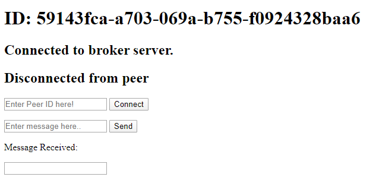

# P2P Sample with PeerJS
This sample uses PeerJS to send/receive messages through websockets between two clients. The underlying broker server used by this sample provided by the PeerJS team. Click [here](https://peerjs.com/peerserver.html) for more info on hosting your own broker server.

### Known Supported Browsers
 - Chrome
 - Firefox
 - Chromium Edge
 - Edge

### Running the sample
1. Clone the [PeerJS-Sample](https://github.com/mastloui/PeerJS-Sample) repository.
2. Click on the [run.cmd](https://github.com/mastloui/PeerJS-Sample/blob/master/run.cmd) file. This should open up 2 instances of the [index.html](https://github.com/mastloui/PeerJS-Sample/blob/master/index.html).
3. Open one of the index file in your browser and copy the ID written at the top.

    For instance, the ID of the above page is **59143fca-a703-069a-b755-f0924328baa6**.

4. Open up the second index file and copy the value in the textbox which has the "Enter Peer ID here!" placeholder text.
5. Click "Connect"

You should now be connected to your peer! You can send a message in one window and you should receive it through the other.

> Note: Open up the console for additional logging!